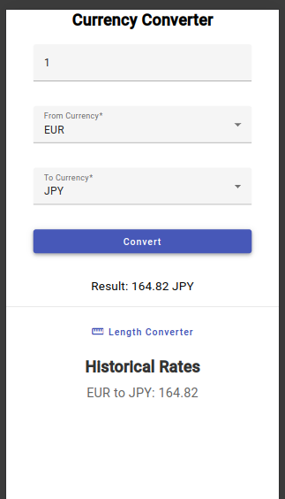
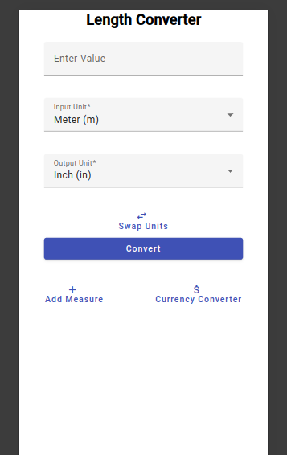
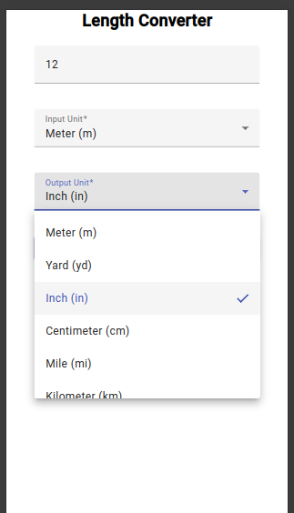
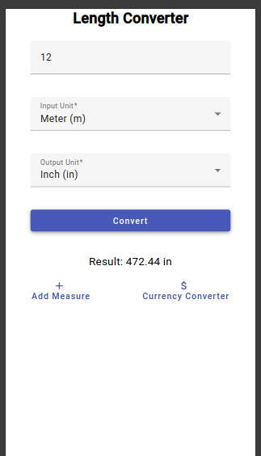
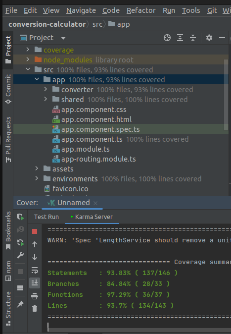

# Conversion Calculator - README

## Overview

Welcome to the Conversion Calculator app! This Angular-based Progressive Web Application (PWA) is designed to provide convenient conversion tools for currency and length units, prioritizing a mobile-first approach. This README will guide you through the setup, features, and usage of the application.

## Features

1. **Currency Converter:**
  - Convert between different currency pairs, supporting at least three pairs.
  - Fetches real-time exchange rates from external APIs for accurate conversions.
  - Bonus feature: Historical view to track conversion trends over time.

2. **Length Unit Converter:**
  - Convert between various length units such as meters, yards, and inches.
  - Supports two-way conversion, allowing users to change values in either the "from" or "to" field.

## Prerequisites

Before running the application, ensure you have the following installed:

- Node.js and npm (Node Package Manager)
- Angular CLI (Command Line Interface)
- Git (for version control)

## Installation

1. Clone this repository to your local machine:

   ```bash
   git clone <repository_url>
   ```

2. Navigate to the project directory:

   ```bash
   cd conversion-calculator
   ```

3. Install dependencies:

   ```bash
   npm install
   ```

## Usage

1. Run the development server:

   ```bash
   ng serve
   ```

2. Open your web browser and navigate to `http://localhost:4200/` to access the application.

3. Explore the currency and length converters by entering values and selecting units.

## Additional Notes

- **Modularity, Maintainability, and Scalability:** The application is designed with these tenets in mind, ensuring easy addition of new units and seamless maintenance.
- **Styling:** Angular Material is utilized for basic styling, providing a clean and consistent user interface across devices.
- **Layout:** Angular Flex-Layout is used for the basic template layout, ensuring responsiveness on various screen sizes.
- **Testing:** The application is fully tested to ensure reliability and accuracy in conversion calculations.

## Screenshots












